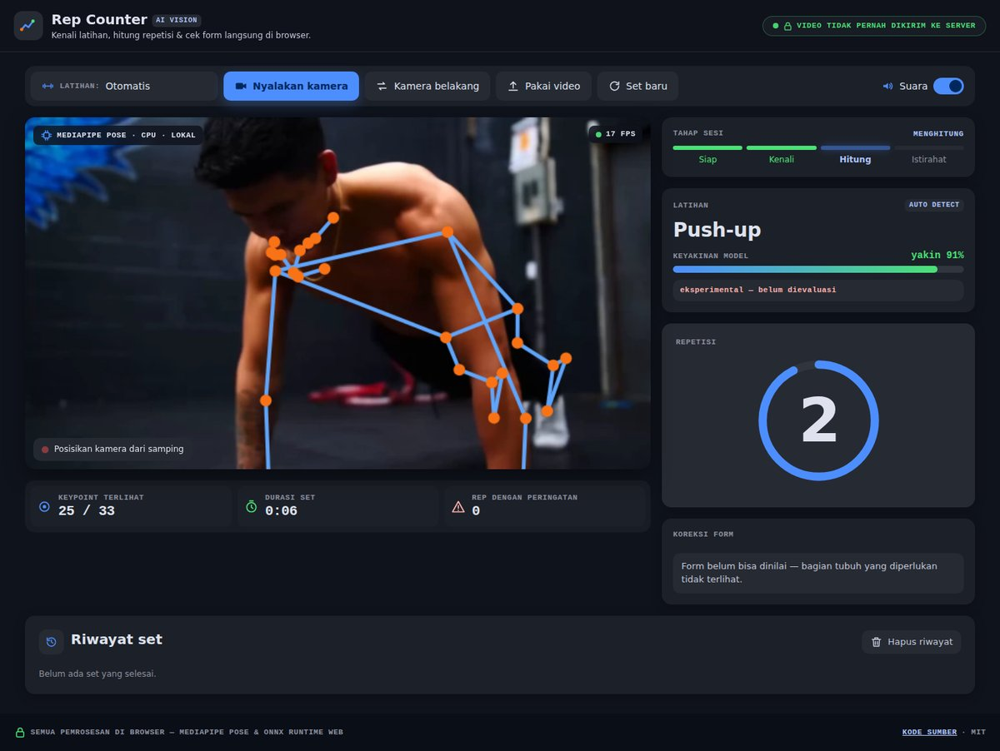
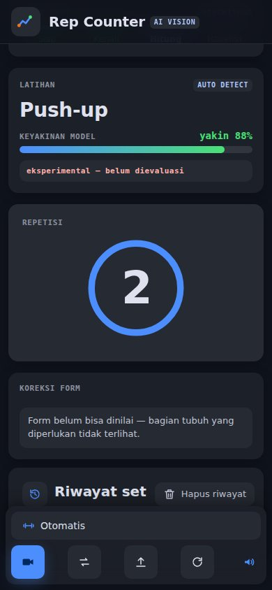
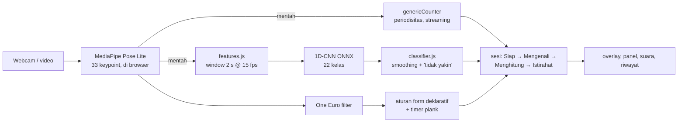

# Rep Counter — penghitung repetisi & koreksi form di browser

[](https://github.com/gilbertusk/fitness-rep-counter/actions/workflows/ci.yml)
[](https://gilbertusk.github.io/fitness-rep-counter/)
[](LICENSE)

Kenali latihan, hitung repetisi, dan dapatkan koreksi form dari webcam atau video —
**semuanya di browser, tanpa satu frame pun dikirim ke server.**

**🔗 Coba langsung: https://gilbertusk.github.io/fitness-rep-counter/** (Chrome/Edge, laptop atau HP)

<p align="center">
  
  
</p>
<p align="center"><sub>Tangkapan layar app asli yang memproses video uji push-up (bukan mock-up).</sub></p>

> **English summary.** A browser-only workout assistant. MediaPipe Pose runs on the device; a small
> 1D-CNN (ONNX, 0.28 MB) recognises **22 exercises** — **0.822 macro-F1 / 81.7% accuracy at video level
> on 93 held-out test videos** (gradient-boosting baseline 0.756); one *generic* streaming rep counter
> works for any exercise without per-exercise thresholds; declarative form rules cover 6 exercises plus a
> plank hold timer. An end-to-end test checks that no request can carry a video frame off the device.
> The app runs at 10–23 FPS on 4-vCPU cloud machines without a GPU, with 0.1–0.5 ms of app logic per frame.
> **Not measured yet:** rep-counting accuracy (waiting for human rep labels) and form-rule accuracy.
> Every number below links to the report that produced it.

## Daftar isi

1. [Fitur](#1-fitur)
2. [Cara pakai](#2-cara-pakai)
3. [Hasil](#3-hasil)
4. [Cara kerja](#4-cara-kerja)
5. [Teknologi](#5-teknologi)
6. [Menjalankan secara lokal](#6-menjalankan-secara-lokal)
7. [Reproduksi: dataset → model → laporan](#7-reproduksi-dataset--model--laporan)
8. [Pengujian, CI, dan deploy](#8-pengujian-ci-dan-deploy)
9. [Struktur repo](#9-struktur-repo)
10. [Keputusan teknis penting](#10-keputusan-teknis-penting)
11. [Keterbatasan & kegagalan yang diketahui](#11-keterbatasan--kegagalan-yang-diketahui)
12. [Status & langkah berikutnya](#12-status--langkah-berikutnya)
13. [Privasi](#13-privasi)
14. [Kredit & lisensi](#14-kredit--lisensi)

## 1. Fitur

| | |
|---|---|
| 🧠 **Pengenal latihan otomatis** | 22 latihan (squat, push-up, bench press, lat pulldown, plank, …) dari window gerakan 2 detik; menjawab "tidak yakin" daripada menebak |
| 🔢 **Penghitung repetisi generik** | satu algoritma untuk semua latihan, tanpa ambang per latihan; bekerja frame demi frame |
| ✅ **Koreksi form** | aturan untuk squat, push-up, barbell biceps curl, lateral raise, deadlift, shoulder press + timer tahan plank; peringatan muncul setelah 0,5 s form buruk |
| 🔊 **Suara** | hitungan rep dan peringatan form dibacakan (Web Speech API), bisa dimatikan |
| ⏱️ **Sesi otomatis** | Siap → Mengenali → Menghitung → Istirahat; set ditutup otomatis setelah diam > 3 s, lalu muncul banner "Set selesai" dan timer istirahat |
| 📋 **Riwayat set** | latihan, jumlah rep, durasi, dan berapa rep tanpa peringatan form; disimpan hanya di perangkat |
| 📷 **Kamera atau video** | webcam depan/belakang, atau pilih file video dari perangkat |
| 🧭 **Petunjuk posisi** | memberi tahu bila tubuh tidak terlihat penuh atau kamera tidak dari samping |
| 📱 **Responsif** | di HP, tombol pindah ke bar bawah yang mudah dijangkau jempol |
| 🔒 **Privat** | MediaPipe dan model pengenal berjalan di browser; diverifikasi per request oleh test e2e |

## 2. Cara pakai

1. Buka **https://gilbertusk.github.io/fitness-rep-counter/** dan tunggu **"Model siap"**
   (unduhan pertama hingga ±30 MB — model pose, MediaPipe, dan runtime pengenal; berikutnya dari cache).
2. Klik **Nyalakan kamera** dan izinkan akses kamera — atau **Pakai video** untuk file rekaman.
3. Berdiri **menyamping** ke kamera dengan **seluruh badan terlihat**, lalu mulai bergerak.
4. Latihan dikenali otomatis (atau pilih sendiri di menu **Latihan**); repetisi dihitung dan peringatan
   form muncul di kartu **Koreksi form**.
5. Diam lebih dari 3 detik untuk menutup set; **Set baru** memulai hitungan dari nol.

## 3. Hasil

Sel "–" berarti **belum diukur**, bukan nol. Angka performa berasal dari VM cloud tanpa GPU dan berbeda
hingga 2× antar-sesi; angka laptop dan HP belum ada.

| Bagian | Metrik | Nilai | Sumber |
|---|---|---|---|
| Data | Frame dengan pose terdeteksi (651 video, 22 kelas) | [97,7 %](reports/00-data/pose_quality.md) | Tahap 0 |
| Data | Split per video & grup near-duplicate (train / val / test) | [453 / 99 / 99](reports/00-data/split.md) | Tahap 0 |
| Pengenal latihan | **Macro-F1 / akurasi, level video, 93 video test** | [**0,822 / 81,7 %**](reports/01-classifier/classifier.md) | Tahap 1 |
| Pengenal latihan | … baseline gradient boosting, pembanding | [0,756 / 80,6 %](reports/01-classifier/classifier.md) | Tahap 1 |
| Pengenal latihan | Macro-F1 / akurasi, level window 2 s (606 window test) | [0,761 / 78,7 %](reports/01-classifier/classifier.md) | Tahap 1 |
| Penghitung repetisi | MAE, OBO vs baseline naive-peaks (test) | – (menunggu label manusia) | `reports/03-rep-counter/` |
| Aturan form | Akurasi peringatan | – (belum ada video form berlabel) | [`docs/FORM_RULES.md`](docs/FORM_RULES.md) |
| Performa | FPS end-to-end, 4 vCPU tanpa GPU, 3 VM | [10–23 FPS](reports/05-performance/performance.md) | Tahap 5 |
| Performa | Latensi pose MediaPipe p50 | [40–93 ms](reports/05-performance/performance.md) | Tahap 5 |
| Performa | Seluruh logika app per frame (`stepFrame`) p50 | [0,1–0,5 ms](reports/05-performance/performance.md) | Tahap 5 |
| Performa | Pengenal latihan per window (sekali per detik) p50 | [0,7–1,1 ms](reports/05-performance/performance.md) | Tahap 5 |
| Performa | Unduhan: model pose + MediaPipe WASM / runtime ONNX | [5,8 + 11,8 MB / 11,9 MB](reports/05-performance/performance.md) | Tahap 5 |
| Performa | FPS laptop / HP | – / – | [cara mengukur](tools/benchmark/README.md) |

Kelas terburuk pengenal (F1 level video): barbell biceps curl 0,50, romanian deadlift 0,50, decline bench
press 0,57, chest fly machine 0,60, bench press 0,67 — detail, confusion matrix, dan jumlah video per kelas
di [`reports/01-classifier/classifier.md`](reports/01-classifier/classifier.md).

## 4. Cara kerja



- **Pose:** MediaPipe Pose Landmarker Lite (mode VIDEO, satu orang) memberi 33 titik tubuh per frame. Di
  perangkat tanpa GPU sungguhan, app memilih jalur CPU MediaPipe karena jauh lebih cepat daripada GPU emulasi.
- **Fitur:** 13 titik + 8 sudut sendi → 47 nilai per frame, dikoreksi rasio aspek, di-resample ke 15 fps,
  dipotong menjadi window 30 frame (2 s) dengan langkah 15 — spesifikasi lengkap di
  [`docs/FEATURES.md`](docs/FEATURES.md).
- **Pengenal latihan:** 1D-CNN kecil (63 702 parameter) di ONNX Runtime Web (WASM). Skor tiap window
  dihaluskan (EMA), dan app hanya menetapkan latihan bila keyakinan ≥ 0,65 **dan** selisih dengan pilihan
  kedua ≥ 0,45 — ambang yang dipilih di data validasi untuk akurasi ≥ 90 %.
- **Penghitung repetisi:** memproyeksikan gerakan ke satu sinyal (PCA online atau sudut sendi paling
  aktif), menghaluskannya, lalu menghitung satu rep tiap kali sinyal keluar dari posisi awal dan kembali
  lagi (histeresis 30/70 %). Tanpa ambang per latihan, jadi bekerja juga untuk latihan tanpa aturan form.
- **Koreksi form:** aturan deklaratif per latihan (`app/src/core/form/rules/`) yang hanya mengukur bila
  titik yang dibutuhkan terlihat; peringatan ditahan 0,5 s agar tidak berkedip. Penjelasan & batasan:
  [`docs/FORM_RULES.md`](docs/FORM_RULES.md).
- **Satu fungsi murni per frame:** semua keputusan ada di `stepFrame` (`app/src/core/session/workout.js`),
  sehingga seluruh loop bisa diuji di Node; `main.js` hanya merangkai adapter browser → core → UI.

## 5. Teknologi

| Bagian | Teknologi |
|---|---|
| Web app | JavaScript ES modules tanpa build step, HTML, CSS; MediaPipe Tasks Vision 1.0.1; ONNX Runtime Web 1.23.2 |
| Pipeline ML | Python 3.11, MediaPipe, OpenCV, NumPy, pandas, scikit-learn, PyTorch (CPU), ONNX |
| Pengujian | `node:test` (+ coverage bawaan Node 22), Playwright, pytest + pytest-cov, ESLint, ruff |
| CI / deploy | GitHub Actions; GitHub Pages (hanya folder `app/`) |

## 6. Menjalankan secara lokal

Butuh **Node 22**. App tidak punya build step dan tidak butuh server khusus.

```bash
git clone https://github.com/gilbertusk/fitness-rep-counter.git
cd fitness-rep-counter
npm ci
npm start            # http://localhost:5173 — kamera hanya bisa diakses dari localhost atau HTTPS
```

Model pengenal (`app/models/exercise_classifier.onnx`) sudah ada di repo; tanpa file itu app tetap
menghitung repetisi dan meminta latihan dipilih manual.

## 7. Reproduksi: dataset → model → laporan

Butuh Python 3.11. Semua data ada di `data/` (di-`.gitignore`; override dengan env `FITNESS_DATA_DIR`).

```bash
# 0 — lingkungan
python -m venv .venv && source .venv/bin/activate
pip install -e "ml[dev,train]" --extra-index-url https://download.pytorch.org/whl/cpu
# Linux: sudo apt-get install libegl1   (dibutuhkan MediaPipe)

# 1 — data & keypoint (Tahap 0) → reports/00-data/
kaggle datasets download ziya07/workout-and-exercise-video-dataset -p data/workout-videos --unzip
python -m repcount.data.download_model
python -m repcount.data.manifest && python -m repcount.data.dedup
python -m repcount.data.extract --workers 4
python -m repcount.evaluation.pose_quality && python -m repcount.data.split

# 2 — pengenal latihan (Tahap 1) → reports/01-classifier/, app/models/
RUN=data/runs/$(date +%Y%m%d-%H%M)
python -m repcount.models.baseline --out $RUN && python -m repcount.models.temporal --out $RUN
python -m repcount.evaluation.classifier_report --run $RUN      # test set dipakai SEKALI di sini
python -m repcount.export.onnx --run $RUN

# 3 — label repetisi oleh manusia (Tahap 2, ±2 jam) → labels/rep_labels.csv
python -m repcount.labels.select            # → labels/to_label.csv
npx serve tools/labeler                     # melabel di browser (petunjuk: labels/README.md)
python -m repcount.labels.validate

# 4 — evaluasi penghitung (Tahap 3) → reports/03-rep-counter/
python -m repcount.export.keypoints_json
node tools/eval/evalReps.js --counter generic --split val
node tools/eval/evalReps.js --counter generic --split test --final   # test set, sekali

# 5 — benchmark (Tahap 5) → reports/05-performance/
node tools/benchmark/headless.js            # atau buka tools/benchmark/ di perangkat nyata
```

**Windows (PowerShell):** aktifkan venv dengan
`Set-ExecutionPolicy -Scope Process Bypass; .\.venv\Scripts\Activate.ps1` (prompt berubah menjadi
`(.venv) PS …`), dan ganti baris `RUN=…` dengan `$RUN = "data/runs/" + (Get-Date -Format "yyyyMMdd-HHmm")`.

Petunjuk per bagian: [`ml/README.md`](ml/README.md), [`labels/README.md`](labels/README.md),
[`tools/eval/README.md`](tools/eval/README.md), [`tools/benchmark/README.md`](tools/benchmark/README.md).

## 8. Pengujian, CI, dan deploy

```bash
npm test                     # 266 unit test JS (core, labeler, eval, benchmark, struktur)
npm run coverage:core        # gagal bila app/src/core/ < 80 % baris, cabang, atau fungsi (kini 100 % baris)
npm run lint                 # ESLint
node tools/checkStructure.js # struktur folder, kemurnian core, panjang file, tidak ada data di git
npm run test:e2e             # 3 test Playwright di Chromium sungguhan (sekali: npx playwright install chromium)
pytest ml/tests --cov=repcount && ruff check ml   # 250 test Python, termasuk parity fitur Python ↔ JS
```

- **CI** ([`.github/workflows/ci.yml`](.github/workflows/ci.yml)) menjalankan semua perintah di atas pada
  setiap pull request dan push ke `main`.
- **E2E** memutar video uji melalui app asli: latihan harus dikenali dan dihitung, tidak boleh ada error
  console, dan tidak boleh ada request yang bisa membawa frame keluar (lihat [Privasi](#13-privasi)).
- **Deploy** ([`.github/workflows/deploy-pages.yml`](.github/workflows/deploy-pages.yml)) dijalankan manual
  dari tab Actions; yang dipublikasikan hanya `app/` tanpa `tests/` (±540 KB termasuk model pengenal).

## 9. Struktur repo

Peta lengkap & konvensi: [`docs/PLAN.md` §4](docs/PLAN.md) — dijaga CI oleh `tools/checkStructure.js`.

```
app/        # 🌐 web app yang di-deploy
  src/core/       logika murni tanpa DOM (fitur, pengenal, penghitung, form, sesi) — 100 % baris ter-test
  src/adapters/   pembungkus browser API: MediaPipe, ONNX, suara, localStorage
  src/ui/         render DOM & kanvas;  src/main.js hanya merangkai
  models/         exercise_classifier.onnx + labels.json (ambang "tidak yakin")
  tests/          unit (mencerminkan src/core), e2e Playwright, fixture
ml/         # 🧠 paket Python `repcount`: data, fitur, model, evaluasi, ekspor, label
tools/      # 🛠️ labeler (label rep), eval (MAE/OBO di Node), benchmark, checkStructure
labels/     # ✍️ label repetisi buatan manusia + definisi satu rep
reports/    # 📊 hasil evaluasi; nomor folder = tahap (00-data, 01-classifier, 05-performance)
docs/       # 📚 PLAN, spesifikasi fitur, aturan form, model card, prompt per tahap, gambar README
data/       # 💾 dataset & turunan — di-.gitignore, tidak pernah di-commit
```

## 10. Keputusan teknis penting

Lengkapnya, dengan angka dan alasan, ada di log keputusan [`docs/PLAN.md` §8](docs/PLAN.md).

- **Satu spesifikasi fitur, dua implementasi** (Python untuk training, JS untuk browser), dijaga parity
  test golden file dengan toleransi 1e-4. Window streaming di browser identik dengan window offline.
- **Model pose offline = model pose browser** (`pose_landmarker_lite`): model dilatih pada keypoint yang
  sama dengan yang dilihat pengguna.
- **Split per video dan per grup near-duplicate** (dHash), seed tetap, di-commit: potongan YouTube yang
  sama tidak bocor antar split. Test set dikunci: evaluasi menolak `--split test` tanpa `--final`.
- **Input penghitung & pengenal adalah keypoint mentah**, sama dengan saat evaluasi; filter One Euro
  hanya dipakai untuk yang dilihat pengguna (overlay, aturan form, timer plank).
- **Penghitung generik tanpa ambang per latihan**, dievaluasi frame demi frame di Node dengan kode yang
  sama persis dengan app.
- **Model kecil:** 1D-CNN dipilih atas GRU (ekspor ONNX lebih sederhana, satu pass per window). Menang
  di macro-F1 atas baseline (0,822 vs 0,756) dengan akurasi hampir sama (81,7 vs 80,6 %).
- **Runtime ONNX versi WASM saja:** bundle WebGPU menarik 25,5 MB untuk model yang berjalan ±1 ms di CPU;
  versi WASM 11,9 MB.
- **MediaPipe di CPU bila WebGL-nya perangkat lunak:** 245 → 35 ms per frame di mesin uji.
- **Kejujuran sebagai aturan kerja:** tidak ada angka karangan, label hanya dari manusia, data sintetis
  hanya untuk uji kewarasan. UI pun hanya menampilkan nilai yang benar-benar diukur.

## 11. Keterbatasan & kegagalan yang diketahui

- **Akurasi penghitung repetisi dan aturan form belum diukur**, jadi semua latihan berlabel
  **eksperimental** di app. Ambang aturan form adalah titik awal yang belum divalidasi; deadlift hanya
  proksi 2D.
- **Test set pengenal kecil:** 93 video, 1–9 per kelas, sehingga F1 per kelas kasar (plank = satu video).
- **Pose 2D dari satu kamera:** aturan form squat, push-up, curl, deadlift, dan plank butuh kamera dari
  samping; app memberi petunjuk bila kamera tampak dari depan.
- **Deteksi pose lemah** pada posisi berbaring dan mesin (decline bench press 87,6 %, romanian deadlift
  88,3 % frame terdeteksi); pergelangan kaki paling sering tidak terlihat.
- **Kelas yang tertukar:** bench press ↔ decline bench press paling sering. Kelas terburuk (biceps curl,
  chest fly) justru punya deteksi pose di atas rata-rata, jadi penyebabnya bukan kualitas pose.
- Hanya satu orang per frame. Waktu rep dilaporkan ±0,2 s lebih awal dari tanda manusia.
- Tanpa GPU, pose 40–93 ms per frame → 10–23 FPS tergantung mesin; HP lemah bisa lebih lambat.
- `.MOV` HEVC dari iPhone mungkin tidak bisa diputar di Chrome desktop.

## 12. Status & langkah berikutnya

| Tahap | Status |
|---|---|
| 0 — Data & keypoint | ✅ 651 video, laporan kualitas pose, split |
| 1 — Pengenal latihan | ✅ dilatih, dievaluasi, diekspor ke app |
| 2 — Label repetisi | 🚧 alat labeling siap, **label manusia belum dibuat** |
| 3 — Penghitung repetisi | 🚧 kode & harness evaluasi siap, menunggu label Tahap 2 |
| 4 — Web app | ✅ deteksi otomatis, hitung, form, plank, UI baru |
| 5 — Siap dipamerkan | 🚧 ter-deploy, CI hijau; tinggal GIF demo dan benchmark laptop/HP |

Yang tersisa: label repetisi (±2 jam, `tools/labeler/`) → evaluasi MAE/OBO → mengganti status
"eksperimental" per latihan sesuai hasilnya. Ide lanjutan: *3D pose lifting* untuk kamera dari depan,
label form dari dataset Fitness-AQA untuk mengukur akurasi aturan form, dan *velocity-based training*
(kecepatan per rep sebagai tanda kelelahan).

## 13. Privasi

Semua inferensi berjalan di browser. Yang diunduh hanya kode, library (`cdn.jsdelivr.net`), dan model pose
(`storage.googleapis.com`); frame video diproses di memori dan tidak pernah dikirim.
`app/tests/e2e/smoke.spec.js` mencatat **setiap** request selama video diproses dan gagal bila ada yang
bukan `GET`, membawa body, atau menuju host selain ketiga host itu. Riwayat set hanya disimpan di
`localStorage` perangkat dan bisa dihapus dengan **Hapus riwayat**. UI tidak memakai CDN font atau ikon.

## 14. Kredit & lisensi

- **Dataset:** [Workout & Exercise Video Dataset](https://www.kaggle.com/datasets/ziya07/workout-and-exercise-video-dataset)
  oleh ziya07 di Kaggle (CC0). Video dan keypoint turunannya **tidak** didistribusikan di repo ini, kecuali
  satu klip uji pendek (MP4 + WebM) di `app/tests/fixtures/videos/`.
- **Model pose & library:** [MediaPipe Pose Landmarker](https://ai.google.dev/edge/mediapipe/solutions/vision/pose_landmarker)
  (Google, Apache-2.0); [ONNX Runtime Web](https://onnxruntime.ai/) (Microsoft, MIT).
- **Model card:** [`docs/MODEL_CARD.md`](docs/MODEL_CARD.md) — termasuk penggunaan yang tidak disarankan:
  **bukan alat medis atau fisioterapi.**
- **Desain UI:** dibuat dari mock-up Google Stitch milik pemilik proyek.
- **Lisensi kode:** [MIT](LICENSE).
