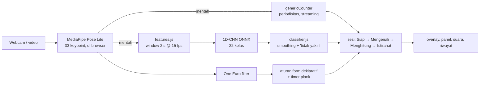

# Rep Counter — penghitung repetisi & koreksi form di browser

> **English summary.** A browser-only workout assistant: MediaPipe Pose runs on the device, one
> *generic* streaming rep counter works for any exercise without per-exercise thresholds,
> declarative form rules cover 6 exercises plus a plank hold timer, and a small 1D-CNN (ONNX,
> 0.28 MB) recognises 22 exercises. Video never leaves the device — an end-to-end test
> checks every request. **Measured:** the exercise classifier reaches **0.822 macro-F1 / 81.7%
> accuracy at video level on 93 held-out test videos** (22 classes; gradient-boosting baseline 0.756),
> and the app runs at 10–23 FPS on 4-vCPU cloud machines without GPU, with ~0.1–0.3 ms of app logic
> per frame. **Not measured yet:** rep-counting accuracy (waiting for human labels) and form-rule accuracy.

Satu kalimat: hitung repetisi dan dapatkan koreksi form dari webcam atau video, **tanpa satu frame
pun dikirim ke server**.

> 🔗 **Demo:** _(diisi setelah deploy disetujui — `.github/workflows/deploy-pages.yml`)_ ·
> 🎬 **GIF:** _(≤ 5 MB, diisi pemilik proyek)_

## 1. Hasil

Setiap angka menaut ke laporan yang menghasilkannya. Sel "–" = **belum diukur**, bukan nol.

| Bagian | Metrik | Nilai | Sumber |
|---|---|---|---|
| Data | Frame dengan pose terdeteksi (651 video, 22 kelas) | [97,7 %](reports/00-data/pose_quality.md) | Tahap 0 |
| Data | Split per video & grup near-duplicate (train/val/test) | [453 / 99 / 99](reports/00-data/split.md) | Tahap 0 |
| Pengenal latihan | Macro-F1 / akurasi, level video, 93 video test (22 kelas) | [**0,822 / 81,7 %**](reports/01-classifier/classifier.md) | Tahap 1 |
| Pengenal latihan | … baseline gradient boosting, untuk pembanding | [0,756 / 80,6 %](reports/01-classifier/classifier.md) | Tahap 1 |
| Pengenal latihan | Macro-F1 / akurasi, level window 2 s (606 window test) | [0,761 / 78,7 %](reports/01-classifier/classifier.md) | Tahap 1 |
| Penghitung repetisi | MAE, OBO vs baseline naive-peaks (test) | – (menunggu label manusia) | `reports/03-rep-counter/` (CSV dari `evalReps.js … --final`) |
| Aturan form | Akurasi peringatan | – (belum ada video form berlabel) | [`docs/FORM_RULES.md`](docs/FORM_RULES.md) |
| Performa | FPS end-to-end, 4 vCPU tanpa GPU (headless Chromium, 2 VM berbeda) | [10–23 FPS](reports/05-performance/performance.md) | Tahap 5 |
| Performa | Latensi pose MediaPipe p50 (VM cepat / VM lambat) | [39,7 / 74–93 ms](reports/05-performance/performance.md) | Tahap 5 |
| Performa | Seluruh logika app per frame (`stepFrame`) p50 | [0,1–0,5 ms](reports/05-performance/performance.md) | Tahap 5 |
| Performa | Pengenal latihan per window (model terlatih, sekali per detik) p50 | [1,1 ms](reports/05-performance/performance.md) | Tahap 5 |
| Performa | FPS laptop / HP | – / – (perlu perangkat nyata) | [cara mengukur](tools/benchmark/README.md) |

## 2. Arsitektur



Semua keputusan per frame ada di satu fungsi murni `app/src/core/session/workout.js` (`stepFrame`);
`main.js` hanya merangkai adapter browser → core → UI. Input penghitung dan pengenal adalah keypoint
**mentah**, sama persis dengan saat evaluasi; filter One Euro hanya untuk yang dilihat pengguna.

## 3. Struktur repo

Detail lengkap & konvensi: [`docs/PLAN.md` §4](docs/PLAN.md) (dijaga CI oleh `tools/checkStructure.js`).

```
app/        # 🌐 web app yang di-deploy: src/core (murni, ter-test) · adapters (browser API) · ui · tests
ml/         # 🧠 paket Python `repcount`: ekstraksi keypoint, split, fitur, training, evaluasi, ekspor ONNX
tools/      # 🛠️ alat developer: labeler (label rep), eval (MAE/OBO di Node), benchmark, checkStructure
labels/     # ✍️ label repetisi buatan manusia + definisi satu rep
reports/    # 📊 hasil evaluasi, nomor folder = tahap (00-data, 05-performance, …)
docs/       # 📚 PLAN, spesifikasi fitur, aturan form, model card, prompt per tahap
data/       # 💾 dataset & turunan — di-.gitignore, tidak pernah di-commit
```

## 4. Keputusan teknis penting

Lengkapnya, dengan angka dan alasan: [`docs/PLAN.md` §8](docs/PLAN.md).

- **Satu spesifikasi fitur, dua implementasi** (Python untuk training, JS untuk browser), dijaga parity
  test golden file toleransi 1e-4 ([`docs/FEATURES.md`](docs/FEATURES.md)). Window streaming di browser
  identik dengan window offline — dibayar 1 frame *look-ahead*.
- **Model pose offline = model pose browser** (`pose_landmarker_lite`): model dilatih di keypoint yang
  sama dengan yang dilihat pengguna.
- **Split per video dan per grup near-duplicate** (dHash), seed tetap, di-commit: mencegah potongan
  YouTube yang sama bocor antar split. Test set dikunci: harness menolak `--split test` tanpa `--final`.
- **Penghitung generik tanpa threshold per latihan:** proyeksi PCA online (atau sudut sendi paling
  aktif), EMA, histeresis 30/70 %, rep dihitung saat sinyal kembali "pulang". Dievaluasi frame demi
  frame di Node dengan kode yang sama persis dengan app.
- **Model kecil:** 1D-CNN 63 702 parameter (≈ 0,28 MB ONNX) dipilih atas GRU; ±1 ms per window di
  browser. Mengalahkan baseline gradient boosting di macro-F1 level video (0,822 vs 0,756), tetapi
  akurasinya hampir sama (81,7 vs 80,6 %): keunggulannya terutama di kelas kecil.
- **MediaPipe di CPU bila WebGL-nya perangkat lunak** (SwiftShader/llvmpipe): 245 → 35 ms per frame
  di mesin uji, 3–4 → 21–24 FPS.
- **Aturan form deklaratif:** tiap aturan hanya mengukur bila titiknya sendiri terlihat
  (visibility ≥ 0,5); "form terlihat baik" hanya muncul bila memang ada yang terukur.
- **Kejujuran sebagai aturan kerja:** tidak ada angka karangan, label hanya dari manusia, data
  sintetis hanya untuk uji kewarasan — tidak pernah dilaporkan sebagai hasil.

## 5. Keterbatasan & kegagalan yang diketahui

- **Akurasi penghitung repetisi dan aturan form belum diukur** (lihat tabel Hasil), jadi semua
  latihan tetap berlabel **eksperimental** di app.
- Pengenal latihan: kelas terburuk di test (F1 level video) barbell biceps curl 0,50, romanian deadlift
  0,50, decline bench press 0,57, chest fly machine 0,60, bench press 0,67; bench press paling sering
  tertukar dengan decline bench press. Test set kecil (93 video, 1–9 per kelas), jadi F1 per kelas
  kasar — plank bernilai 1,0 dari **satu** video ([laporan](reports/01-classifier/classifier.md)).
  Ambang "tidak yakin" (keyakinan 0,65, selisih 0,45; dipilih di val untuk akurasi ≥ 90 %) masing-masing
  menahan ±26 % window val; app memakai keduanya, jadi lebih sering menjawab "tidak yakin" daripada menebak.
- Pose 2D dari satu kamera: aturan form squat, push-up, curl, deadlift, dan plank butuh kamera dari
  **samping**; app memberi petunjuk bila kamera tampak dari depan. Deadlift hanya proksi 2D.
- Deteksi pose lemah pada posisi berbaring dan mesin: decline bench press 87,6 %, romanian deadlift
  88,3 % frame terdeteksi; pergelangan kaki paling sering tak terlihat ([laporan](reports/00-data/pose_quality.md)).
- Hanya satu orang per frame. Waktu rep dilaporkan ±0,2 s lebih awal dari tanda manusia.
- Tanpa GPU, pose 40–93 ms per frame (> 33 ms per frame video 30 fps) → 10–23 FPS, tergantung VM;
  HP lemah bisa lebih lambat.
- Runtime ONNX (bundle WebGPU) menarik WASM ±24 MB — kandidat optimisasi
  ([performance.md](reports/05-performance/performance.md)).
- `.MOV` HEVC dari iPhone mungkin tidak bisa diputar di Chrome desktop.

## 6. Reproduksi (dataset → laporan)

Butuh Node 22 dan Python 3.11. Semua data di `data/` (override: env `FITNESS_DATA_DIR`).

```bash
# 0 — lingkungan
npm ci
python -m venv .venv && source .venv/bin/activate        # Windows Git Bash: .venv/Scripts/activate
pip install -e "ml[dev,train]" --extra-index-url https://download.pytorch.org/whl/cpu
# Linux: sudo apt-get install libegl1   (dibutuhkan MediaPipe)

# 1 — data & keypoint (Tahap 0) → reports/00-data/
kaggle datasets download ziya07/workout-and-exercise-video-dataset -p data/workout-videos --unzip
python -m repcount.data.download_model
python -m repcount.data.manifest && python -m repcount.data.dedup
python -m repcount.data.extract --workers 4
python -m repcount.evaluation.pose_quality && python -m repcount.data.split

# 2 — pengenal latihan (Tahap 1) → reports/01-classifier/, app/models/
RUN=data/runs/$(date +%Y%m%d-%H%M)
python -m repcount.models.baseline --out $RUN && python -m repcount.models.temporal --out $RUN
python -m repcount.evaluation.classifier_report --run $RUN      # test set dipakai SEKALI di sini
python -m repcount.export.onnx --run $RUN

# 3 — label repetisi oleh manusia (Tahap 2, ±2 jam) → labels/rep_labels.csv
python -m repcount.labels.select            # → labels/to_label.csv
npx serve tools/labeler                     # melabel di browser (petunjuk: labels/README.md)
python -m repcount.labels.validate

# 4 — evaluasi penghitung (Tahap 3) → reports/03-rep-counter/
python -m repcount.export.keypoints_json
node tools/eval/evalReps.js --counter generic --split val
node tools/eval/evalReps.js --counter generic --split test --final   # test set, sekali

# 5 — app, test, benchmark (Tahap 4–5) → reports/05-performance/
npm start                                   # http://localhost:5173
npm test && npm run coverage:core && npm run lint && node tools/checkStructure.js
pytest ml/tests --cov=repcount && ruff check ml
npm run test:e2e                            # sekali dulu: npx playwright install chromium
node tools/benchmark/headless.js            # atau buka tools/benchmark/ di perangkat nyata
```

Petunjuk per bagian: [`ml/README.md`](ml/README.md), [`labels/README.md`](labels/README.md),
[`tools/eval/README.md`](tools/eval/README.md), [`tools/benchmark/README.md`](tools/benchmark/README.md).
CI (`.github/workflows/ci.yml`) menjalankan unit test, gerbang coverage ≥ 80 % untuk `app/src/core/`,
ESLint, pytest + ruff (termasuk parity fitur), cek struktur, dan smoke test Playwright.

## 7. Kredit, lisensi, privasi

- **Dataset:** [Workout & Exercise Video Dataset](https://www.kaggle.com/datasets/ziya07/workout-and-exercise-video-dataset)
  oleh ziya07 di Kaggle (CC0). Video dan keypoint turunannya **tidak** didistribusikan di repo ini.
- **Model pose & library:** [MediaPipe Pose Landmarker](https://ai.google.dev/edge/mediapipe/solutions/vision/pose_landmarker)
  (Google, Apache-2.0); [ONNX Runtime Web](https://onnxruntime.ai/) (Microsoft, MIT).
- **Lisensi kode:** belum ditentukan oleh pemilik proyek.
- **Model card:** [`docs/MODEL_CARD.md`](docs/MODEL_CARD.md) — termasuk penggunaan yang tidak disarankan
  (bukan alat medis atau fisioterapi).
- **Privasi:** semua inferensi berjalan di browser. `app/tests/e2e/smoke.spec.js` mencatat **setiap**
  request selama video diproses dan gagal bila ada yang bukan `GET`, membawa body, atau menuju host
  selain app itu sendiri, CDN library (`cdn.jsdelivr.net`), dan bucket model pose
  (`storage.googleapis.com`). Riwayat set hanya disimpan di `localStorage` perangkat dan bisa dihapus.
