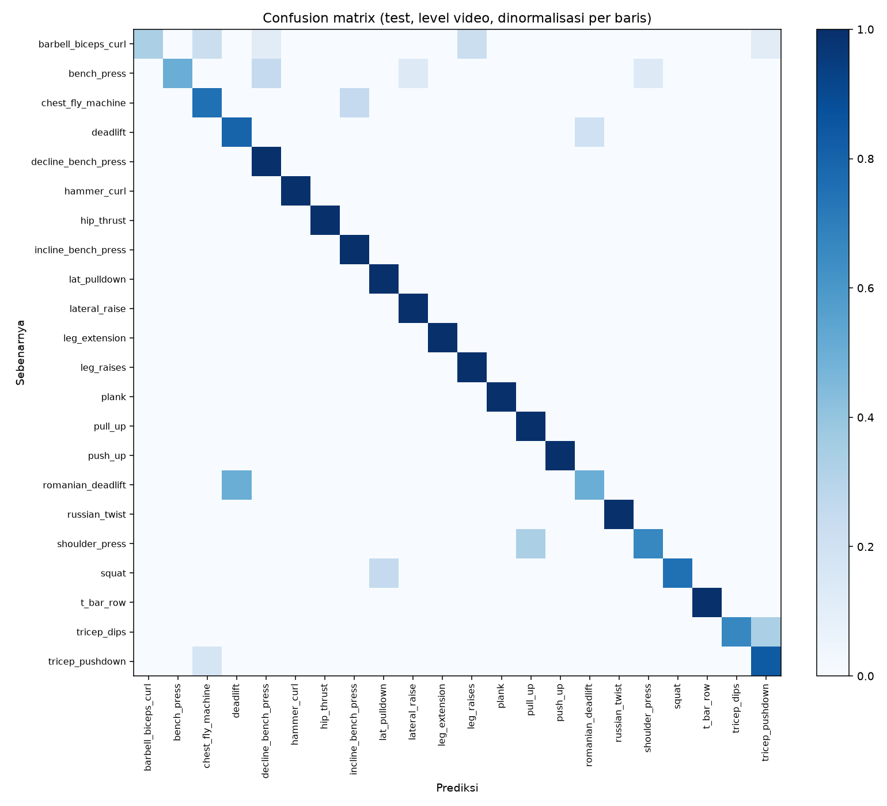

# Pengenal jenis latihan (22 kelas)

Perintah: `python -m repcount.models.baseline` · `python -m repcount.models.temporal` · `python -m repcount.evaluation.classifier_report` · `python -m repcount.export.onnx`

Window 30 frame @ 15 fps (stride 15), 47 fitur per frame — spesifikasi: `docs/FEATURES.md`.

> **Test set dipakai sekali saja**, oleh skrip ini, di akhir. Pemilihan model dan semua ambang diputuskan dari split validasi.

Window: train 2761, val 738, test 606 (window dengan > 30% frame hilang dibuang).

## Hasil di test set

### Level window

| Model | Akurasi | Macro-F1 | n window |
|---|---:|---:|---:|
| baseline (gradient boosting) | 0.774 | 0.723 | 606 |
| temporal (1D-CNN) | 0.787 | 0.761 | 606 |

### Level video (rata-rata probabilitas seluruh window video)

| Model | Akurasi | Macro-F1 | n video |
|---|---:|---:|---:|
| baseline (gradient boosting) | 0.806 | 0.756 | 93 |
| temporal (1D-CNN) | 0.817 | 0.822 | 93 |

Model terbaik menurut macro-F1 level video: **temporal (1D-CNN)**.

## F1 per kelas (level video, model terbaik)

| Kelas | F1 | n video test |
|---|---:|---:|
| barbell_biceps_curl | 0.500 | 9 |
| bench_press | 0.667 | 8 |
| chest_fly_machine | 0.600 | 4 |
| deadlift | 0.800 | 5 |
| decline_bench_press | 0.571 | 2 |
| hammer_curl | 1.000 | 3 |
| hip_thrust | 1.000 | 3 |
| incline_bench_press | 0.889 | 4 |
| lat_pulldown | 0.933 | 7 |
| lateral_raise | 0.923 | 6 |
| leg_extension | 1.000 | 4 |
| leg_raises | 0.750 | 3 |
| plank | 1.000 | 1 |
| pull_up | 0.857 | 3 |
| push_up | 1.000 | 8 |
| romanian_deadlift | 0.500 | 2 |
| russian_twist | 1.000 | 2 |
| shoulder_press | 0.667 | 3 |
| squat | 0.857 | 4 |
| t_bar_row | 1.000 | 3 |
| tricep_dips | 0.800 | 3 |
| tricep_pushdown | 0.769 | 6 |

Kelas dengan ≤ 2 video test hanya bisa bernilai 0, 0,5, 0,67, atau 1 — jangan dibaca sebagai angka yang presisi.

Lima kelas terburuk: barbell_biceps_curl (0.50), romanian_deadlift (0.50), decline_bench_press (0.57), chest_fly_machine (0.60), bench_press (0.67).

## Kelas yang paling sering tertukar

| Sebenarnya | Diprediksi | Jumlah | % dari kelas |
|---|---|---:|---:|
| barbell_biceps_curl | chest_fly_machine | 2 | 22% |
| barbell_biceps_curl | leg_raises | 2 | 22% |
| bench_press | decline_bench_press | 2 | 25% |
| barbell_biceps_curl | decline_bench_press | 1 | 11% |
| barbell_biceps_curl | tricep_pushdown | 1 | 11% |

Deteksi pose kelas-kelas terburuk (Tahap 0, `reports/00-data/pose_quality.md`; seluruh dataset 97.7%): barbell_biceps_curl 97.8%, romanian_deadlift 88.3%, decline_bench_press 87.6%, chest_fly_machine 99.9%, bench_press 91.7%. Di bawah rata-rata dataset, jadi pose yang hilang bisa ikut menjelaskan: romanian_deadlift, decline_bench_press, bench_press. Di atas rata-rata dataset, jadi kualitas deteksi pose **tidak** menjelaskan: barbell_biceps_curl, chest_fly_machine — penyebabnya harus dicari di kelas yang tertukar dan videonya.

## Ambang "tidak yakin"

Dipilih dari split **validasi**: cut-off terkecil yang membuat akurasi prediksi yang dipertahankan mencapai 90%.

| Ambang | Nilai | Cakupan | Akurasi saat dipertahankan |
|---|---:|---:|---:|
| confidence | 0.65 | 74% | 0.902 |
| margin | 0.45 | 73% | 0.910 |

## Model di browser

- Berkas: `app/models/exercise_classifier.onnx`, **270 KB**, opset 18
- ONNX vs PyTorch pada 100 window: beda maks **5.72e-06** (toleransi 1e-04)
- Waktu inferensi CPU per window: median **0.08 ms**, p95 0.09 ms (200 kali)
